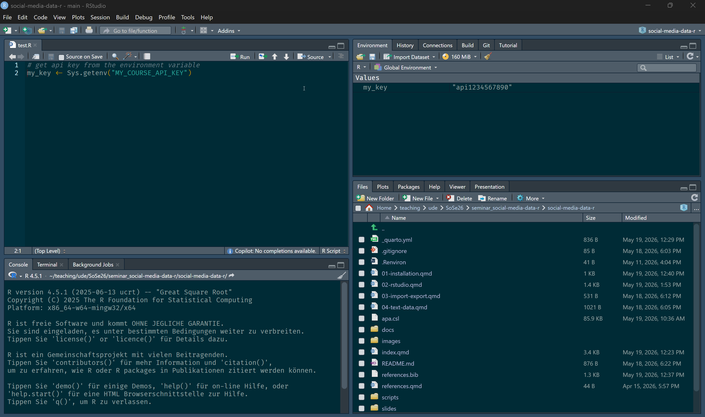
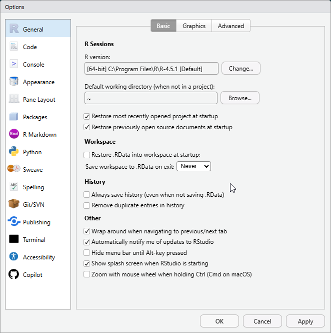
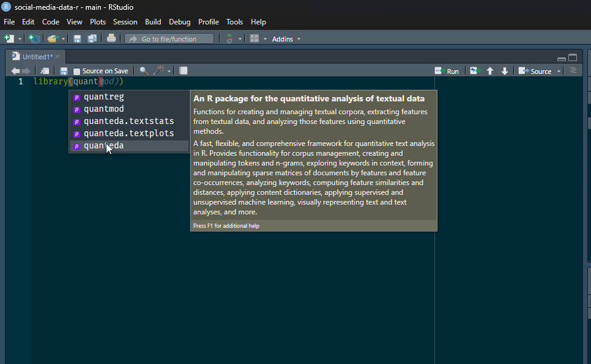

# Arbeiten mit *RStudio*

Sofern `R` und *RStudio* installiert sind (siehe @sec-install), können Sie *RStudio* starten. Wenn alles korrekt installiert wurde, startet *RStudio* dann automatisch auch `R`.

## Das Interface von *RStudio*

Wenn Sie *RStudio* zum ersten Mal öffnen, sollten Sie drei Fenster im Programm sehen.

Im ersten Schritt können Sie nun ein neues R-Skript erstellen. Im Kurs werden wir für die Sammlung, Aufbereitung und Analyse von Daten mit R-Skripten arbeiten. Diese enthalten Code, können zudem auch Kommentare enthalten und haben die Dateiendung `.r`.

Um ein neues `R`-Skript in *RStudio* zu erstellen, gibt es drei Optionen:

1. Klicken Sie auf das Symbol "New File" (kleines weißes Rechteck mit grün-weißem + oben links in der Ecke) in der Symbolleiste und wählen dann "R script" aus dem Dropdown-Menü.

2. Wählen Sie im *RStudio*-Menü ganz oben File -> New File -> R script.

3. Nutzen Sie die Tastenkombination `Strg + Shift + N` (Windows) bzw. `Cmd + Shift + N` (Mac).

Sobald Sie ein neues `R`-Skript erstellt haben, sollten Sie in *RStudio* vier Fenster sehen, die jeweils mehrere Tabs haben können und wie folgt angeordnet sind:

**Oben links** befindet sich der Texteditor für die Dateien, an denen Sie gerade arbeiten. Meistens sind dies `R`-Skripte.

**Oben rechts** ist das Fenster mit Informationen zum Arbeitsbereich (Workspace) zu finden. Der wichtigste Tab hier ist die "Environment" (Umgebung), in der Informationen zu den Objekten in Ihrer Arbeitsumgebung angezeigt werden. Dies können einzelne Werte, Vektoren oder ganze Datensätze sein (Erklärungen zu den unterschiedlichen Objekttypen in `R` sind im Abschnitt @sec-objects zu finden). Im "History"-Tab können Sie hier auch den Verlauf der ausgeführten Befehle einsehen.

**Unten links** ist die sogenannte Konsole (Console). Hier können Sie interaktiv Code ausführen. Auch Warnungen und Fehlermeldungen sowie Ausgaben zu ausgeführtem Code aus Skripten werden hier angezeigt, sofern es sich dabei um Text handelt. Im Fenster mit der Konsole wird auch ein "Terminal"-Tab angezeigt, über das Sie auf die [Kommandozeile](https://de.wikipedia.org/wiki/Kommandozeile) zugreifen können. 

Im Fenster **unten rechts** befinden sich mehrere Tabs, die auch für Einsteiger_innen in die Nutzung von `R` und *RStudio* interessant sind:

  - Im "Files"-Tab finden Sie die Dateien, die sich in Ihrem aktuellen Arbeitsverzeichnis (Working Directory; mehr dazu im nächsten Abschnitt) befinden. 
  
  - Im "Packages"-Tab können Sie sehen, welche `R`-Pakete Sie installiert und in der aktuellen Sitzung (Session) geladen haben.
  
  - Im Tab "Help" können Sie die Dokumentation zu Funktionen und Paketen in `R` einsehen. Mehr dazu finden Sie im Abschnitt @sec-help.
  
  - In den Tabs "Plots" und "Viewer" werden Grafiken (Plots) und HMTL-Ausgaben bzw. interaktive Inhalte (Viewer) angezeigt, die Sie mit `R` erstellen können.

Der Tab "Git" wird nur angezeigt, wenn Sie `git` installiert und in *RStudio* eingerichtet haben und in einem *RStudio*-Projekt arbeiten, das mit einem *Git*-Repository verbunden ist. Wenn Sie mehr dazu erfahren möchten, ist das Online-Buch [*Happy Git and GitHub for the useR*](https://happygitwithr.com/) vo Jenny Bryan sehr empfehlenswert.


{width="90%" fig-align="center"}

## Workflow {#sec-workflow}

### R-Skripte

Code, der in der Kosole ausgeführt wird, wird nicht gespeichert. Alles was Sie behalten/speichern möchten, sollte daher in `R`-Skripten gemacht werden. 

Sie können `R`-Skripte jederzeit speichern, indem Sie auf das Disketten-Symbol in der Symbolleiste klicken oder die Tastenkombination `Strg + S` (Windows) bzw. `Cmd + S` (Mac) verwenden. Es empfiehlt sich, Skripte regelmäßig zu speichern, um Datenverlust zu vermeiden.

Um zu dokumentieren, was der Code in Ihrem Skript macht, können Sie Kommentare hinzufügen. Kommentare sind Zeilen, die mit einem Hashtag (#) beginnen und von `R` ignoriert werden. Sie können Kommentare verwenden, um zu erklären, was der Code tut, warum bestimmte Entscheidungen getroffen wurden oder um Notizen für sich selbst oder andere zu hinterlassen.

```{r}
# Dies ist ein Kommentar. Er wird von R ignoriert und dient nur zur Dokumentation.
# Sie können hier z.B. erklären, was der folgende Code macht.

# Berechnung der Summe von 1 und 1
1 + 1
```

Weitere Tipps & Tricks zum Kommentieren von `R`-Skripten finden Sie im Abschnitt @sec-comments.

### Code ausführen

#### Konsole

In der Konsole können Sie Code direkt eingeben und ausführen, indem Sie die Eingabetaste drücken. Wenn Sie in der letzten Zeile in der Konsole das `>`-Zeichen sehen, bedeutet dies, dass `R` bereit für weitere Befehle ist. Wenn Sie am Anfang der Eingabezeile in der Konsole ein `+` sehen, bedeutet dies, dass der Befehl unvollständig ist. Ein häufiger Grund dafür ist eine fehlende Klammer `)` oder ein fehlendes Anführungszeichen `"` (weitere Tipps zum Umgang mit häufigen Fehlern in `R` finden Sie im Abschnitt @sec-errors). Sie können den Befehl entweder vervollständigen (und ihn dann durch Drücken der Eingabetaste ausführen) oder die Eingabe des Befehls durch Drücken der Esc-Taste abbrechen.

Sobald Sie mindestens einen Befehl ausgeführt haben, können Sie mit den Tasten ↑ und ↓ auf Ihrer Tastatur in der Konsole in *RStudio* durch die vorherigen Befehle "blättern" und diese erneut ausführen.

Das Einfachste, was Sie mit der R-Konsole tun können, ist, sie als Taschenrechner zu verwenden.

```{r}
2 + 2

7 - 6

3 * 4

10 / 2

2^3
```

Das [1] vor dem Ergebnis zeigt an, dass es sich um den ersten Ausgabewert des Befehls handelt (komplexere Befehle können mehr als einen Ausgabewert haben).

### `R`-Skripte

Für `R`-Skripte gibt es mehrere Möglichkeiten, Code auszuführen:

1. Sie können das gesamte Skript ausführen, indem Sie auf das Symbol "Source" (weißes Rechteck mit blauem Pfeil) oben rechts in der Symbolleiste klicken oder die Tastenkombination `Strg + Shift + Enter` (Windows) bzw. `Cmd + Shift + Enter` (Mac) verwenden.

2. Markieren Sie die Code-Zeilen, die Sie ausführen möchten, und klicken Sie auf das Symbol "Run" (Ausführen) in der Symbolleiste oder verwenden Sie die Tastenkombination `Strg + Enter` (Windows) bzw. `Cmd + Enter` (Mac).

3. Klicken Sie mit der Maus auf die Zeile, die Sie ausführen möchten, und verwenden Sie die Tastenkombination `Strg + Enter` (Windows) bzw. `Cmd + Enter` (Mac), um die aktuelle Zeile auszuführen. Wenn Sie mehrere Zeilen ausführen möchten, können Sie diese markieren und dann die gleiche Tastenkombination verwenden.

### Arbeitsverzeichnis & Arbeitsbereich {#sec-wd}

Das Arbeitsverzeichnis (*Working Directory*) ist der Ordner auf Ihrem Computer, in dem `R` nach Dateien sucht, die Sie laden möchten, und in dem es Dateien speichert, die Sie erstellen.

Das aktuelle Arbeitsverzeichnis wird in der Zeile über der Konsole in *RStudio* angezeigt, wo auch die aktuell genutzte Version von `R` zu sehen ist. Sie können es sich auch über den Befehl `getwd()` anzeigen lassen.

```{r}
# Aktuelles Arbeitsverzeichnis anzeigen
getwd()
```

Sie können das Arbeitsverzeichnis in *RStudio* auf zwei Arten ändern:

1. Indem Sie im Menü in *RStudio* auf "Session" -> "Set Working Directory" -> "Choose Directory" klicken und dann den gewünschten Ordner auswählen. Alternativ können Sie hier auch die Optionen "To Project Directory" (Hauptverzeichnis des Projekts, wenn Sie mit *RStudio*-Projekten arbeiten; mehr dazu in @sec-projects), "To Source File Location" (= Speicherort des aktuell aktiven `R`-Skripts) oder "To Files Pane Location" (= Ordner, der aktuell im "Files"-Tab angezeigt wird) auswählen.

2. Über den Befehl `setwd()`.

Begrifflich ähnlich aber technisch gesehen etwas anderes ist der sogenannte Arbeitsbereich (*Workspace*). Der Arbeitsbereich umfasst alle Objekte, die Sie in `R` erstellt oder geladen haben, wie z.B. Variablen, Funktionen oder Datensätze. Diese Objekte werden im "Environment"-Tab oben rechts in *RStudio* angezeigt.

Der Inhalt der aktuellen Umgebung wird im Arbeitsspeicher (RAM) Ihres Computers gespeichert, bis Sie `R` (oder *RStudio*) beenden.

Der aktuelle Inhalt des Arbeitsbereichs kann auch über den Befehl `ls()` angezeigt werden.
Mit der Funktion `rm()`können Objekte aus dem Arbeitsbereich entfernen. **Wichtig**: Dies kann nicht rückgängig gemacht werden. D.h. Objekte müssen dann ggf. neu erstellt werden. 

Standardmäßig speichert `R` den Arbeitsbereich in einer Datei namens `.RData` im aktuellen Arbeitsverzeichnis und stellt den Arbeitsbereich beim Neustart wieder her.

Das Speichern des Arbeitsbereichs kann zwar nützlich sein, sollte jedoch nicht Ihre primäre -- und v.a. nicht die ausschließliche -- Methode zum Speichern Ihrer Arbeit sein. Stattdessen sollten Sie Skripte verwenden, um Ihren Code zu speichern, und alle Ausgaben (einschließlich relevanter Zwischenergebnisse; insbesondere wenn deren Erstellung viel Zeit in Anspruch nimmt) wie Datensätze oder Abbildungen (Plots) in Dateien mit einem geeigneten Format speichern (mehr dazu im Abschnitt @sec-import).


## Einstellungen in *RStudio*

Um die Umsetzung des im vorherigen Abschnitts empfohlenen Workflows zu erleichtern, sollten Sie einige Einstellungen in *RStudio* vornehmen. Klicken Sie dazu auf "Tools" -> "Global Options" und nehmen im Reiter "General" folgende Einstellungen vor:

- Unter "Workspace" Entfernen Sie das Häkchen bei "Restore .RData into workspace at startup" und wählen Sie "Never" aus dem Dropdown-Menü bei "Save workspace to .RData on exit". So wird verhindert, dass Ihr Arbeitsbereich automatisch gespeichert wird, wenn Sie *RStudio* schließen und dass alte Objekte automatisch geladen werden, wenn Sie *RStudio* starten.

- Entfernen Sie das Häkchen unter "History" bei der Option "Always save history (even when not saving .RData)" aktivieren. So wird Ihre Befehls-Historie (Command History) nicht jedes Mal automatisch gespeichert. Wenn Sie die Command History explizit speicher möchten, können Sie dafür den Befehl `savehistory()` nutzen. Dieser erstellt dann eine `.Rhistory`-Datei im Arbeitsverzeichnis. Sie sollten Code, den Sie behalten und wiederverwenden möchten allerdings in eigenen `R`-Skripten speichern (s.o.).

Sie können in den Optionen noch viele weitere Einstellungen vornehmen. Z.B. können Sie dort das Aussehen von *RStudio* oder die Formatierung von Code in `R`-Skripten anpassen.

{fig-align="center"}

## Hilfreiche Funktionen in *RStudio*

Neben den Einstellungen gibt es zwei weitere Funktionalitäten, die die Arbeit mit *RStudio* erleichtern können:

1. Tastaturkürzel: *RStudio* bietet eine Vielzahl von Tastenkombinationen, mit denen Sie schneller und effizienter arbeiten können. Einige davon haben wir zuvor bereits gesehen. Eine Übersicht über die verfügbaren Tastenkombinationen finden Sie unter "Help" -> "Keyboard Shortcuts Help" in *RStudio*.

2. Tab Completion: In *RStudio* können Sie die Tab-Taste verwenden, um Code zu vervollständigen. Wenn Sie z.B. den Namen einer Funktion oder eines Objekts eingeben und dann die Tab-Taste drücken, zeigt *RStudio* eine Liste der möglichen Vervollständigungen an. Dies kann besonders hilfreich sein, wenn Sie sich nicht sicher sind, wie der Name einer Funktion oder eines Objekts lautet oder wenn Sie Tippfehler vermeiden möchten.

{fig-align="center"}