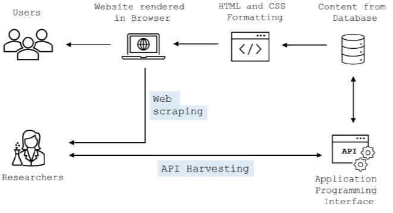

# Erhebungsmethoden {#sec-collection-methods}

Es gibt verschiedene Zugangswege zu Social-Media-Daten, die jeweils eigene Vorteile und Herausforderungen mit sich bringen [@BreuerEtAl2020]. Die in der Forschung bislang am häufigsten genutzten Optionen sind Application Programming Interfaces (APIs) und Web Scraping.

Eine ausführliche Einführung in Web Scraping und die Nutzung von APIs geht über den Rahmen dieses Buches hinaus, aber die nachfolgende Abbildung aus Deubel et al. [-DeubelEtAl2024] bietet einen vereinfachten visuellen Vergleich der beiden Methoden.

{fig-align="center"}
Umnfangreichere Einführungen zu Web Scraping und APIs für den Datenzugang finden sich in den entsprechenden *GESIS Guides to Digital Behavioral Data* von Soldnet et al. [-@SoldnerEtAl2024a; -@SoldnerEtAl2024b].

Viele Social-Media-Plattformen bieten APIs an, über die Forschende auf Daten zugreifen können. Einen guten -- wenn auch stellenweise bereits etwas veralteten -- Überblick bietet die Webseite [*APIs for social scientists: A collaborative review*](https://paulcbauer.github.io/apis_for_social_scientists_a_review/).

## Ausgewählte Plattformen

Für diesen Kurs konzentrieren wir uns auf die folgenden Plattformen:

- *Bluesky* (@sec-bluesky-collection)

- *TikTok* (@sec-tiktok-collection)

- *YouTube* (@sec-youtube-collection)

Die Auswahl dieser Plattformen hat dabei v.a. zwei Gründe:

1. Sie sind relevant für Forschung zu politischer Kommunikation.

2. Der Zugang zu Daten von diesen Plattformen ist vergleichsweise einfach, da sie entweder eine vergleichsweise offene API anbieten oder die Daten über Web Scraping relativ leicht zugänglich sind.

Wir gehen dabei in aufsteigender Reihenfolge der Schwierigkeit des Datenzugangs vor, d.h. wir beginnen mit *Bluesky*, für das es eine offene API gibt, gefolgt von *TikTok*, für das wir eine sogenannte "Hidden API" nutzen, und *YouTube*, für das wir einen API Key benötigen.

## Beobachtungseinheiten & Sampling

Die Beobachtungseinheiten für *Bluesky* und *TikTok* sind die Accounts von Kandidierenden zur deutschen Bundestagswahl 2025. Die Informationen zu diesen stammen aus dem Datensatz [*Social-Media-Konten der Kandidierenden bei der Bundestagswahl 2025*](https://doi.org/10.4232/1.14773) [@BreuerEtAl2026]. Wir nutzen für diese beiden Plattformen in den Beispielen entsprechend ein accountbasiertes Sampling.

Unsere Beobachtungseinheiten für *YouTube* sind die Videos zu bestimmten Themen oder auch aus bestimmten Kanälen, die wir z.B. über die Websuche der Plattform identifizieren können.