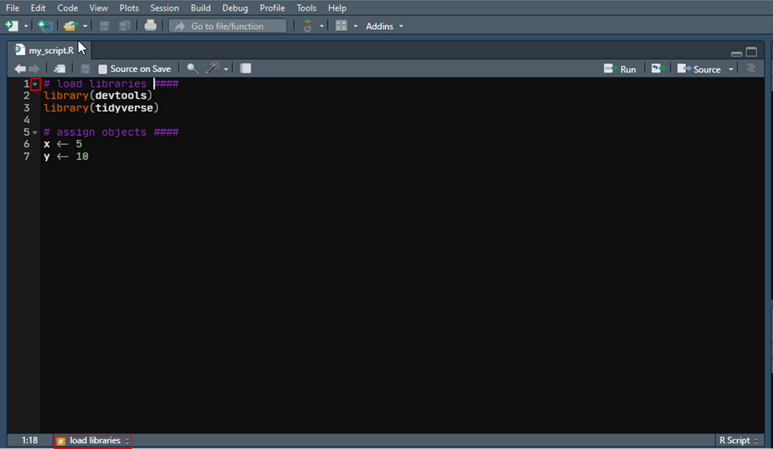

# Kommentare in R-Skripten {#sec-comments}

Wenn Sie einen in einem `R`-Skript in *RStudio* einen Kommentar vor einem Code-Block mit `####` (oder mehreren `#` oder `----` oder mehreren Bindestrichen) beenden, können Sie einen Abschnitt in Ihrem Skript erstellen, der im Skriptfenster von *RStudio* ein- und ausgeblendet werden kann. Dadurch wird außerdem am unteren Rand des Skriptfensters ein kleines interaktives Inhaltsverzeichnis für das Skript erstellt.

Sie können auch die Tastenkombination `Strg + Umschalt + R` (Windows & Linux)/`Cmd + Umschalt + R` (Mac) verwenden, um Codeabschnitte einzufügen. In diesem Fall müssen Sie dann im Pop-Up-Fenster, dass sich öffnet, noch einen Namen für den Abschnitt vergeben.

{width="80%" fig-align="center"}
