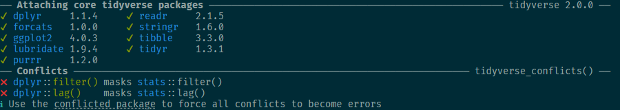

# Namen in `R` {#sec-names}

Es gibt eine sehr große Zahl von Paketen für `R`. Laut der Seite [METACRAN](https://www.r-pkg.org/) gab es am 19. Mai 2025 fast 23.700 Pakete auf *CRAN* (hinzu kommen noch Pakete aus anderen Quellen wie *GitHub*). Diese werden von vielen unterschiedlichen Personen entwickelt (laut METACRAN waren es am 19.05.2025 insgesamt knapp 10.600 sogenannte "Package Maintainer").

Angesichts dieser Vielzahl ist es nicht verwunderlich, dass es in `R` viele Funktionen gibt, die denselben Namen haben (zumal es auch Grenzen für die Kreativität bei der Benennung von Funktionen gibt).Lädt man in einer `R`-Session verschiedene Pakete, die Funktionen mit demselben Namen verwenden, führt dies zu sogenannten "namespace conflicts".

## 😷 Masking

Wenn Sie ein Paket laden und einige seiner Funktionen dieselben Namen haben wie Funktionen aus Paketen, die Sie zuvor in Ihrer aktuellen `R`-Sitzung geladen haben, werden diese Funktionen „ausgeblendet“ (engl. "masked").

{width="80%" fig-align="center"}

Die Reihenfolge, in der Pakete (innerhalb einer Sitzung) geladen werden, ist dabei von Bedeutung, da die "Maskierung" von Funktionen nacheinander erfolgt. Sie können jedoch weiterhin auf maskierte Funktionen zugreifen. Dazu müssen Sie den Namen des Pakets angeben, aus dem die Funktion stammt, gefolgt von `::` und dem Namen der Funktion.

```{r}
#| eval: false

# Zugriff auf die Funktion filter() aus base-R-Paket stats nach dem Laden von dplyr
stats::filter()
```

Auf diese Weise kann man auch auf einzelne Funktionen aus installierten Paketen zugreifen, ohne das gesamte Paket zu laden. Dies kann hilfreich sein, um Konflikte zu vermeiden oder um nur eine bestimmte Funktion aus einem Paket zu verwenden, ohne alle Funktionen dieses Pakets in den Arbeitsspeicher zu laden.